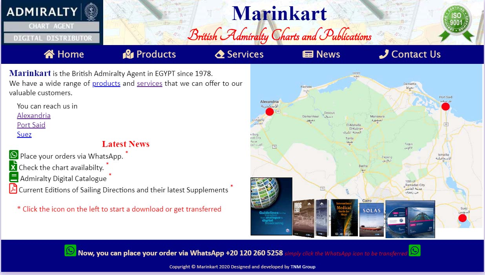
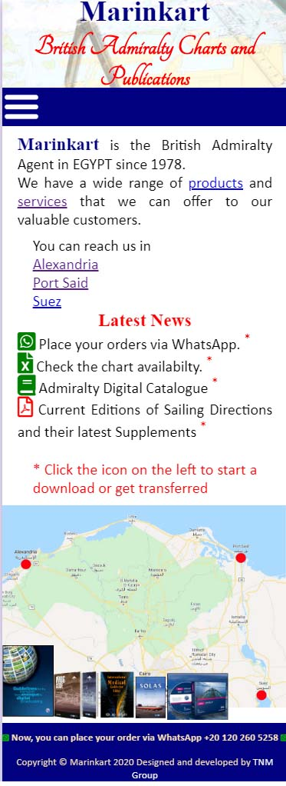

# Marinkart
## Description
Simple and very light responsive website created using `HTML`, `CSS` and `Javascript` to the agent of the British Admiralty in Egypt.

The main purpose of this website is to provide information and updates to the clients of the agency and create an online presence for them to increase their sales, by advertising their products and services.

## Usage and Testing
You may try the website and navigate through its menus and sections on either [GitHub Pages](https://tonymelek.github.io/marinkart/) or on the live website [Marinkart.com](http://www.marinkart.com).

### Landing Page 
#####  Desktop View

#####  Mobile View

## Feedback
Please, send me any comments, questions, or suggestions on my e-mail [tonymelek.au@gmail.com](mailto:tonymelek.au@gmail.com)
## License
The website was developed and designed by [Tony Melek](mailto:tonymelek.au@gmail.com) and copyright &copy; 2020 for TNM Investments Group.
